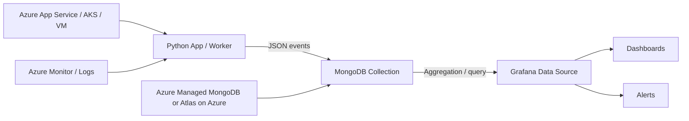

<style>
#page-root {
  grid-template-columns: 1fr !important;
}

#page-root > :not(:first-child) {
  display: none !important;
}

button[title="Show editor"],
button[title="Hide editor"],
button[title="More Options"] {
  display: none !important;
}

#slidev-goto-dialog {
  display: none !important;
}
</style>

# Real-Time Observability with MongoDB and Grafana
## From Logs to Dashboard on Azure

- Event: Grafana and Friends Singapore
- Date: 14 May 2026
- Focus: practical observability pipeline for modern apps


---
layout: section
---

# Agenda

1. Why this matters now
2. End-to-end architecture
3. Python demo: ingest and query telemetry
4. Grafana dashboard and alerts
5. Azure deployment and operations tips
6. Key takeaways and Q&A


---

# Why Observability Needs a Rethink

- Logs are high volume, low value without structure
- Dashboards often show symptoms too late
- Teams need near real-time, queryable signals
- Target: raw event to decision in under 60 seconds

## Outcomes

- Faster incident triage
- Better service confidence
- Lower MTTR with focused alerts


---

# Architecture at a Glance



## Data path

1. Python services emit structured telemetry events
2. Events are stored in MongoDB with time-series-friendly schema
3. Grafana queries MongoDB for live panels and alert rules


---

# Event Model (What We Store)

```json
{
  "ts": "2026-05-14T11:15:13.221Z",
  "service": "checkout-api",
  "environment": "prod-sg",
  "level": "ERROR",
  "latency_ms": 812,
  "status_code": 500,
  "route": "/api/checkout",
  "trace_id": "c7843a8e8e2048f3",
  "message": "payment gateway timeout"
}
```

## Design choices

- Keep hot filter fields flat: service, environment, level, route
- Use UTC timestamp in ts
- Include trace_id for cross-tool correlation


---

# Python Demo Setup

## Install dependencies

```bash
python -m venv .venv
source .venv/bin/activate
pip install pymongo python-dotenv faker
```

## Environment variables

```bash
export MONGODB_URI="mongodb+srv://<user>:<password>@<cluster>/"
export MONGODB_DB="observability"
export MONGODB_COLLECTION="app_events"
```

## Security note

- Store URI in Key Vault or secret store
- Never commit credentials


---
class: text-sm
---

# Python Demo 1 - Event Producer (Core)

```python
import os
import random
from datetime import datetime, timezone
from pymongo import MongoClient

client = MongoClient(os.environ["MONGODB_URI"], appname="grafana-demo")
coll = client["observability"]["app_events"]

def generate_event():
    return {
        "ts": datetime.now(timezone.utc),
        "service": random.choice(["checkout-api", "catalog-api"]),
        "environment": "prod-sg",
        "level": random.choice(["INFO", "WARN", "ERROR"]),
        "latency_ms": max(int(random.gauss(220, 90)), 5),
    }

coll.insert_many([generate_event() for _ in range(200)])
print("Inserted demo batch")
```

- Full runnable script: `demo/producer.py`
- Keep event shape stable for dashboard queries


---
class: text-sm
---

# Python Demo 2 - Useful Indexes

```python
# demo/indexes.py
import os
from pymongo import MongoClient, ASCENDING, DESCENDING

coll = MongoClient(os.environ["MONGODB_URI"])["observability"]["app_events"]

coll.create_index([("ts", DESCENDING)])
coll.create_index([("service", ASCENDING), ("ts", DESCENDING)])
coll.create_index([("route", ASCENDING), ("ts", DESCENDING)])

print("Indexes created")
```

## Why these indexes

- Time-window queries stay fast
- Panel-level groupings avoid full scans
- Alert checks can execute frequently with predictable latency

- Full runnable script: `demo/indexes.py`


---
class: text-sm
---

# Python Demo 3 - Query for Dashboard Panels

```python
# demo/query_metrics.py
import os
from datetime import datetime, timedelta, timezone
from pymongo import MongoClient

coll = MongoClient(os.environ["MONGODB_URI"])["observability"]["app_events"]

window_start = datetime.now(timezone.utc) - timedelta(minutes=5)

pipeline = [
    {"$match": {"ts": {"$gte": window_start}, "environment": "prod-sg"}},
    {
        "$group": {"_id": "$service", "count": {"$sum": 1}}
    },
    {"$sort": {"count": -1}}
]

for row in coll.aggregate(pipeline):
    print(row)
```

- Full runnable script: `demo/query_metrics.py`

---

# Panel Mapping Idea

- Stacked bar: event count by service and level
- Stat: p95 latency per service
- Table: top error routes in last 5 minutes
- Variable filters: service, environment, and time window


---

# MongoDB Atlas Integration

1. Create an Atlas project and cluster (M10+ for demo stability)
2. Add database user with least privilege
3. Allow network access from Codespaces IP (or private endpoint)
4. Copy SRV string from Atlas Connect
5. Set env vars used by demo scripts

```bash
export MONGODB_URI="mongodb+srv://<user>:<pass>@<cluster>/"
export MONGODB_DB="observability"
export MONGODB_COLLECTION="app_events"
```


---

# Atlas + Grafana Integration Paths

## Path A: Grafana MongoDB data source plugin

- Grafana queries Atlas directly
- Best for fast dashboard prototyping

## Path B: Python API between Grafana and Atlas

- Grafana calls your API; API queries Atlas
- Better control over auth, caching, and query safety

## Recommended for production

- Use Atlas IP access controls or PrivateLink
- Use TLS and scoped DB roles


---

# Running the Demo Live

```bash
python demo/indexes.py
python demo/producer.py
python demo/producer.py
python demo/query_metrics.py
```

## During talk

- Run producer multiple times to create burst traffic
- Show how error count and p95 change over time
- Correlate one spike with route and status code dimensions


---

# Grafana Data Source and Panels

## Data source options

- Atlas plugin path: direct query from Grafana
- API path: Grafana reads from Python metrics endpoint

## Recommended starter dashboard

1. Event throughput by minute
2. Error rate by service
3. P95 latency by route
4. Top 10 error messages

## Dashboard design tips

- Keep first row about health state
- Put drill-down tables below trend panels
- Label units and thresholds explicitly
- Use service/environment variables for filtering


---

# Alerting Strategy (Actionable, Not Noisy)

## Sample alert rules

- Error rate above 5 percent for 5 minutes
- p95 latency above 600 ms for checkout-api
- Status code 5xx count spike compared to prior baseline

## Good practices

- Alert on symptoms first, cause second
- Route alerts by service ownership
- Add runbook links inside alert annotations


---

# Azure Deployment Patterns

## Typical setup

- App runtime: Azure App Service or AKS
- Data store: MongoDB Atlas on Azure or compatible managed offering
- Visualization: Grafana (self-managed or managed)

## Secure connectivity

- Store MongoDB URI in Azure Key Vault
- Use private networking where possible
- Restrict database roles to least privilege

## Operations

- Track ingestion lag and query latency
- Set cost guardrails for high-cardinality data


---

# What to Measure in Production

- Ingestion success rate
- End-to-end freshness: event timestamp to panel render delay
- Dashboard query latency
- Alert precision: true positive vs noise
- Cost per million events and retention period

## Target benchmark

- Freshness under 60 seconds
- High-severity alert acknowledgment under 5 minutes


---

# Common Pitfalls and Fixes

- Unstructured logs only -> enforce event schema contract
- Missing indexes -> slow dashboards and alert checks
- Too many dimensions -> cardinality explosion
- Alert spam -> add hysteresis and time windows
- Secrets in code -> move to Key Vault and environment injection


---
layout: section
---

# Key Takeaways

- Structured events unlock actionable observability
- MongoDB plus Grafana works well for near real-time operations
- Python can provide a simple, extensible telemetry pipeline
- Azure adds secure and scalable deployment patterns

## Next step after this session

- Start with one service, one dashboard, one high-value alert


---

# Q and A

## Reference

- Meetup: https://www.meetup.com/grafana-and-friends-singapore/events/314162971

Thank you.
